# Pokédex

**Autor:** Joseph
**Actividad:** Actividad final – Desarrollo de una Pokédex con JavaScript

## Descripción

Aplicación web que muestra los 151 Pokémon de la primera generación consultando [PokéAPI](https://pokeapi.co/). Genera las tarjetas dinámicamente con JavaScript y permite buscar, filtrar por tipo y consultar información ampliada de cada Pokémon.

## Tecnologías utilizadas

- HTML5
- CSS3
- JavaScript puro (módulos ES, `fetch`, `async/await`)
- PokéAPI
- Git y GitHub

## Instrucciones para ejecutarla

1. Clona el repositorio:
   ```bash
   git https://github.com/JVC0/pgl-2dam.git
   ```
2. Entra en la carpeta del proyecto.
3. Abre `index.html` con **Live Server** (VS Code) o con un servidor local. No funciona abriendo el archivo directamente, porque el proyecto usa `type="module"`.

## Estructura del proyecto

```text
pokedex/
├───assets
│   └───images
├───css
├───img
└───js
```

## Funcionalidades implementadas

- [ ] Carga de los 151 Pokémon desde PokéAPI
- [ ] Tarjetas con número, nombre, sprite, tipos, altura y peso
- [ ] Cambio de sprite (espalda → frente) al pasar el cursor
- [ ] Búsqueda por nombre, número y fragmento
- [ ] Filtro por tipo combinable con la búsqueda
- [ ] Panel con información ampliada (habilidades y estadísticas)
- [ ] Gestión de estados de carga, errores y búsquedas sin resultados
- [ ] El el corlor del tipo es basado en el tipo


---

## 1. Punto de partida

### Descripción de la mini-Pokédex inicial

La mini-pokedex busca en la el numero o letra insertada para generar una carta de pokemon

### Estructura inicial

```text
mini-pokedex
├───css
├───img
└───js
```

### Capturas

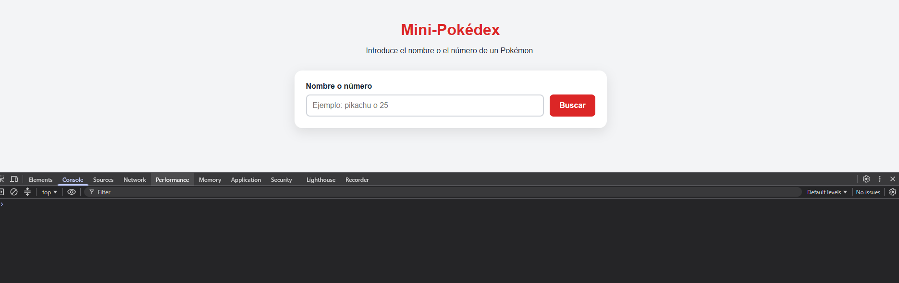

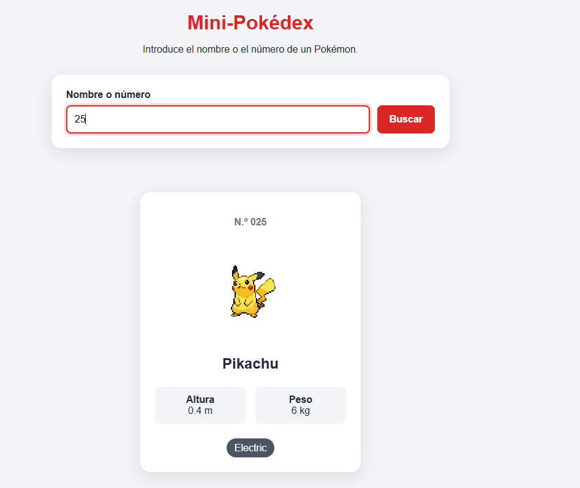

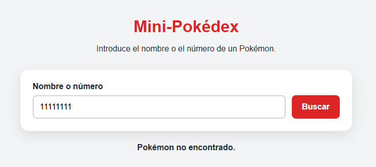

### Commit del punto de partida

- Commit: `https://github.com/JVC0/pgl-2dam/commit/ff6ae857b7ca927bedf54f206c919c0e5dcace91`

---

## 2. Carga de los 151 Pokémon

### Cambios respecto al código inicial

Se a modificado la llamada al la api

### Consulta y transformación de los datos

StartPokedex es una funcion asincrona que tiene un bucle for recorre del id 1 al 151 y en cada ejecucion hace un llamada a la api para recoger los datos de todos los pokemons.

```js
const startPokedex = async () => {
    for (let i = 1; i <= 151; i++) {
        const result = await fetch(`https://pokeapi.co/api/v2/pokemon/${i}/`);
        const data = await result.json();
        pokemons.push(new Pokemon(data));
    }
    showPokedex();
};
```

### Capturas

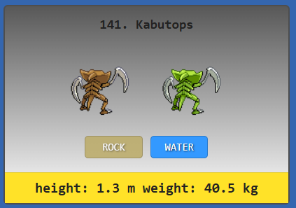

---

## 3. Construcción de las tarjetas

### Datos seleccionados de PokéAPI

- id,spite,tipo, peso ,altura, sprite shiny, experiencia base, abilidades

### Generación dinámica de las tarjetas

crearTarjeta coje el objecto pokemon revisa si el pokemon tiene dos tipos o uno y despues construye un html inyectando la informacion de pokemon.


```js
const crearTarjeta = (pokemon) => {
    const singleTypeClass = isSingleType(pokemon.pkm_tipo1, pokemon.pkm_tipo2) ? "single-type" : "";

    return `<div class="card">
                <div class="idname">
                    ${pokemon.id}. ${pokemon.name}<br>
                </div>
                <br>
                
                
                
                
                <br>
                <div class="type ${singleTypeClass}" style="background-color: ${getColorByType(pokemon.pkm_tipo1)};">
                    ${pokemon.pkm_tipo1}
                </div>
                <div class="type ${singleTypeClass}" style="background-color: ${getColorByType(pokemon.pkm_tipo2)}; opacity: ${NoEmptyTypes(pokemon.pkm_tipo2)};">
                    ${pokemon.pkm_tipo2}
                </div>
                <div>
                <button class="verdetalle" data-id="${pokemon.id}">Ver detalle</button>
                </div>
                <div class="phy">
                    <div class="size">
                        height: ${pokemon.pkm_height / 10} m
                        weight: ${pokemon.pkm_weight / 10} kg
                    </div>
                </div>
            </div>`;
};
```

### Cambio entre sprite trasero y frontal

Con css y html e utlizado una animacion para que cuando pusieras el raton ensima del la carta se cambiara el sprite al de front y no e tenido que hace mas de una peticion a la api ya que cuando cargo la api por primera ves guardo todo en una variable pokemons


### Capturas

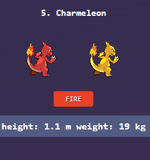

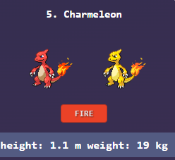

---

## 4. Barra de búsqueda y filtros

### Funcionamiento de la búsqueda

Obtener pokemon esta recibiendo lo que se a puesto en la barra de busquedad  y le esta quitando  los espacios y poniendo en minuscula y despues pasa por un bloque de condiciones que cuando se cumplen retornan la lista de pokemons que se an encontrado.


### Capturas

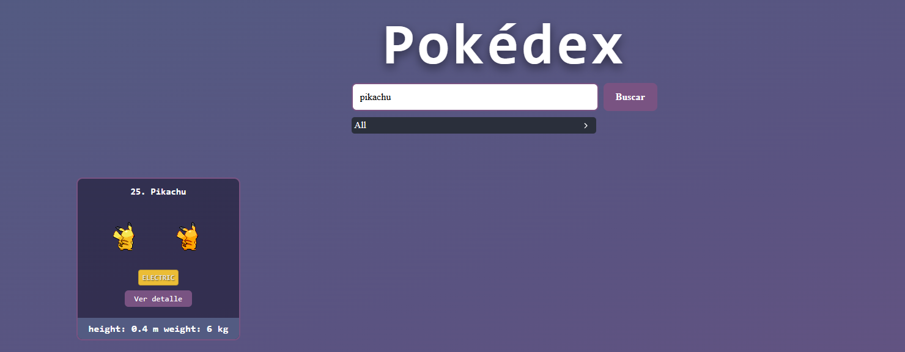

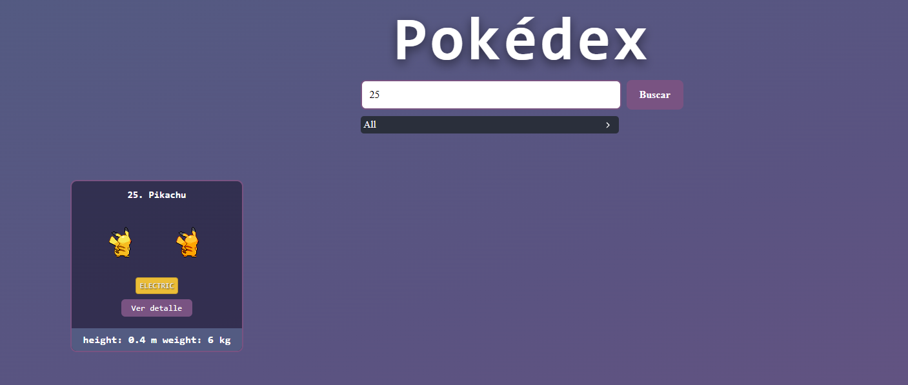

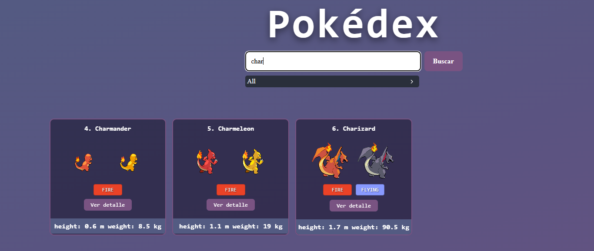

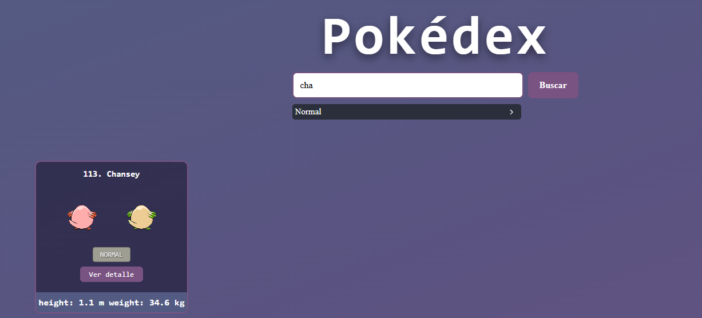


---

## 5. Información ampliada

### Panel de detalles
El panel de ver detalle se genera cuando se da click a boton que llama a una funcion crearmodal() que genera el html y para cerrar el modal utilzo un display none

### Datos adicionales mostrados

- Imagen frontal en mayor tamaño
- Tipos, altura y peso
- Experiencia base
- Habilidades
- Estadísticas base (hp, attack, defense, special-attack, special-defense, speed)

### Capturas

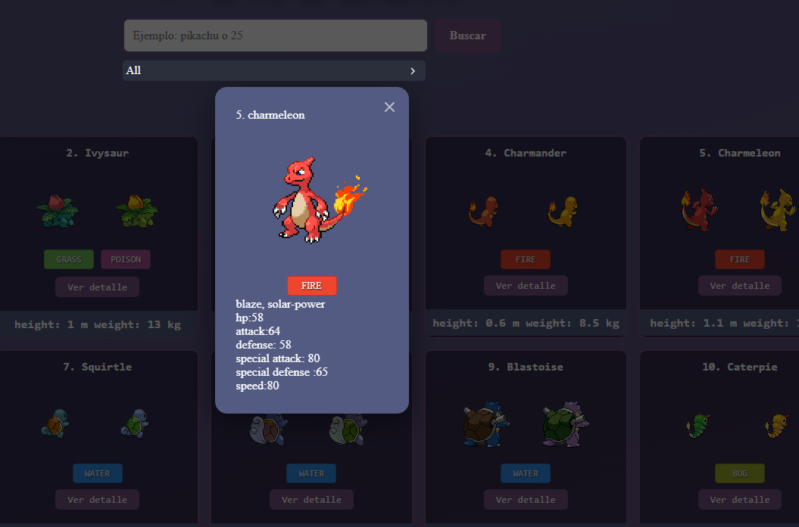

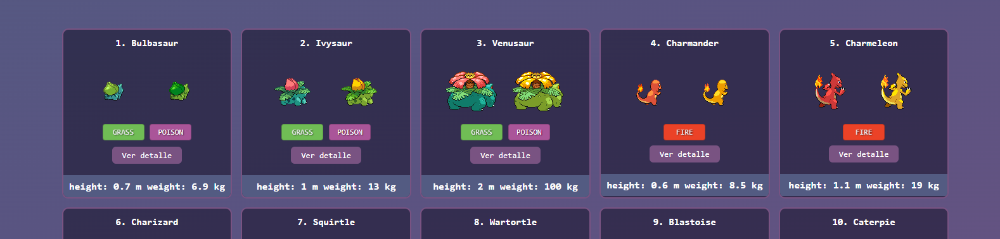


## Modificaciones finales

### Mostrar el numero de pokemons ensenados

Se a anadido un html con las clase numero que ha sido cambiado basado en el numeros de pokemons que se an cargado.
```html
<div class="numero"></div>
```

```js
const numero = document.querySelector(".numero");
const obtenerPokemon = (busqueda) => {
    const texto = String(busqueda).trim().toLowerCase();
    const tipo = document.querySelector('input[name="option"]:checked').value;

    const lista =
        tipo === "all"
            ? pokemons
            : pokemons.filter(
                  (p) => p.pkm_tipo1 === tipo || p.pkm_tipo2 === tipo,
              );

    const exacto = lista.find((pokemon) => pokemon.name === texto);
    if (exacto){
        numero.innerHTML = `<div>${exacto.length}</div>`
        return exacto
    };

    const id = Number(texto);
    if (texto !== "" && Number.isInteger(id)) {
        const porId = lista.find((pokemon) => pokemon.id === id);
        numero.innerHTML = `<div>${porId.length}</div>`
        if (porId)return[porId];
            
    }
    const empizapor =lista.filter((p) => p.name.startsWith(texto))
    numero.innerHTML = `<div>${empizapor.length}</div>`
    return empizapor;
    };
```

### Capturas


